<h1 align="center">SuperAgent - 多智能体 AI 平台</h1>

<p align="center">
  
  
  
  
  
</p>

<p align="center">
  <b>🎓 个人学习项目 | 基于 Spring AI 和 Spring Boot 构建的多智能体 AI 平台</b>
</p>

<p align="center">
  支持 ReAct 推理、工具调用、RAG 检索增强生成和 MCP 协议
</p>

<p align="center">
  <a href="#项目简介">项目简介</a> •
  <a href="#核心特性">核心特性</a> •
  <a href="#快速开始">快速开始</a> •
  <a href="#项目截图">项目截图</a> •
  <a href="#版本更新">版本更新</a> •
  <a href="#已知问题">已知问题</a> •
  <a href="#更新计划">更新计划</a>
</p>

---

## 目录

- [项目简介](#项目简介)
- [核心特性](#核心特性)
- [技术栈](#技术栈)
- [快速开始](#快速开始)
  - [环境要求](#环境要求)
  - [安装步骤](#安装步骤)
  - [数据库初始化](#数据库初始化)
- [项目截图](#项目截图)
- [项目结构](#项目结构)
- [技能系统](#技能系统-skills)
- [API 文档](#api-文档)
- [配置说明](#配置说明)
- [版本更新](#版本更新)
- [已知问题](#已知问题)
- [更新计划](#更新计划)
- [许可证](#许可证)
- [联系方式](#联系方式)

---

## 项目简介

> 🎓 **本项目为个人学习项目**，旨在深入学习和实践 Spring AI、多智能体架构、RAG 等前沿技术。代码可能存在不足之处，欢迎交流探讨！

SuperAgent 是一个多智能体 AI 平台，采用前后端分离架构。后端基于 **Spring Boot 3.5 + Spring AI + Spring AI Alibaba** 构建，前端使用 **Vue 3 + Vite**（AI 辅助开发）。

该平台支持多种 AI 代理模式（ReAct、ToolCall），分别实现了两种框架即 **Spring AI + Spring AI Alibaba 组件** 和 **纯 Spring AI Alibaba** 的 Agent 完整逻辑实现，内置丰富的工具生态，支持多模型接入（通义千问、OpenAI、DeepSeek、智谱 AI、MiniMax、Ollama 本地模型等），并具备完整的用户认证、会话管理、RAG 知识库等功能。

**学习重点**：
- Spring AI 框架深入实践
- 多智能体架构设计与实现
- ReAct 推理模式应用
- RAG 检索增强生成
- MCP 协议集成
- 流式响应与 SSE 实时通信

---

## 核心特性

### 多智能体架构
- **ReAct Agent**: 支持推理-行动循环，让 AI 能够自主规划并调用工具解决问题
- **ToolCall Agent**: 直接工具调用模式，适用于明确的工具执行场景
- **SuperAgent**: 核心超级代理，支持动态模型路由、拦截器链、Hook 机制

### 丰富的工具生态
平台内置 20+ 种工具，分为三类（许多实现可能不够优雅和完善，欢迎 PR 改进）：

| 类别 | 工具 | 功能描述 |
|------|------|----------|
| **通用工具** | PlanningTool | 任务规划与分解 |
| | SensitiveFilterTool | 敏感词过滤 |
| | AskUserQuestionTool | 主动向用户提问 |
| **在线工具** | WebSearchTool | 网络搜索 |
| | TavilySearchTool | Tavily 智能搜索 |
| | Crawl4aiTool | 网页内容爬取 |
| | EmailTool | 邮件发送 |
| | TouTiaoNewsTool | 头条新闻获取 |
| | SmartWebFetchTool | 智能网页获取 |
| | DateTimeTool | 日期时间处理 |
| | MarkdownToPdfTool | Markdown 转 PDF |
| **本地工具** | BashTool | Bash 命令执行 |
| | BrowserUseTool | 浏览器自动化（Selenium） |
| | FileOperationTool | 文件操作 |
| | PDFGenerationTool | PDF 生成 |
| | SandboxTool | 沙箱环境 |
| | TerminalOperationTool | 终端操作 |
| **MCP 工具** | MCP Client | 支持 Model Context Protocol 协议 |

### 多模型支持
- **通义千问** (DashScope) - 默认推荐
- **OpenAI** (GPT-4/GPT-3.5)
- **DeepSeek**
- **智谱 AI** (GLM)
- **MiniMax**
- **Ollama** (本地模型部署)

### RAG 检索增强生成
- 基于 PGVector 的向量数据库支持
- 文档加载与向量化存储
- 查询重写与上下文增强
- 支持 Markdown 文档知识库

### 企业级功能
- **用户认证**: 基于 Sa-Token 的权限认证体系，支持密码/手机号登录注册
- **会话管理**: 支持多会话、会话归档、历史消息管理
- **聊天记忆**: 支持 Redis、数据库、文件多种存储方式
- **消息队列**: RabbitMQ 异步处理会话归档
- **定时任务**: 自动归档过期会话
- **文件存储**: MinIO 对象存储支持
- **模型管理**: 多模型配置、分组管理、Token 用量监控
- **接口监控**: 使用 Alibaba 的 ARMS 监控项目运行情况

### 智能拦截器与 Hook 机制
- **动态模型路由**: 根据任务类型自动选择最优模型
- **提示词注入**: 动态修改系统提示词
- **工具缓存**: 智能缓存工具调用结果
- **消息修剪**: 自动管理上下文窗口
- **响应验证**: 确保输出质量

---

## 技术栈

### 后端技术栈
| 技术 | 版本 | 用途 |
|------|------|------|
| Spring Boot | 3.5.11 | 核心框架 |
| Spring AI | 1.1.3 | AI 开发框架 |
| Spring AI Alibaba | 1.1.2.0 | 阿里云 AI 生态 |
| Java | 21 | 编程语言 |
| MyBatis Plus | 3.5.15 | ORM 框架 |
| MySQL | 8.0+ | 关系型数据库 |
| PostgreSQL | 14+ | 向量数据库 (PGVector) |
| Redis | 7.0+ | 缓存与会话存储 |
| RabbitMQ | 3.12+ | 消息队列 |
| Redisson | 3.52.0 | Redis 客户端 |
| Sa-Token | 1.45.0 | 权限认证 |
| MinIO | 8.6.0 | 对象存储 |
| Selenium | 4.15.0 | 浏览器自动化 |

### 前端技术栈
| 技术 | 版本 | 用途 |
|------|------|------|
| Vue | 3.4.21 | 前端框架 |
| Vite | 5.1.6 | 构建工具 |
| Element Plus | 2.6.1 | UI 组件库 |
| Pinia | 2.1.7 | 状态管理 |
| Marked | 12.0.1 | Markdown 渲染 |
| KaTeX | 0.16.45 | 数学公式渲染 |

> 前端采用 AI 辅助开发模式快速构建

---

## 快速开始

### 环境要求
- JDK 21+
- Maven 3.9+
- MySQL 8.0+
- PostgreSQL 14+ (带 pgvector 扩展)
- Redis 7.0+
- RabbitMQ 3.12+
- Node.js 18+ (前端)

### 安装步骤

#### 1. 克隆项目
```bash
git clone https://github.com/yourusername/SuperAgent.git
cd SuperAgent
```

#### 2. 数据库初始化

**创建数据库：**
```sql
-- 创建 MySQL 数据库
create database superagent default character set utf8mb4 collate utf8mb4_unicode_ci;

-- 创建 PostgreSQL 向量数据库 (用于 RAG)
CREATE EXTENSION IF NOT EXISTS vector;
```

**执行 SQL 脚本：**
```bash
# 使用 MySQL 命令行或客户端工具执行
mysql -u root -p superagent < sql/db.sql
```

> 📄 SQL 脚本位置：[./sql/db.sql](./sql/db.sql)
>
> 该脚本包含：
> - 用户表、角色表、权限表
> - 会话表、消息表
> - 模型管理相关表（Model、ModelConfig、ModelGroup、ModelProvider）
> - 基础角色数据（管理员、访客、普通用户、会员）
> - 权限配置数据

#### 3. 配置文件
复制 `application-dev.yml` 模板并配置：
```bash
cp src/main/resources/application.yml src/main/resources/application-dev.yml
```

编辑 `application-dev.yml`，配置以下关键信息：
- MySQL 数据库连接
- PostgreSQL 向量数据库连接
- Redis 连接
- RabbitMQ 连接
- AI 模型 API Key（DashScope/OpenAI/DeepSeek 等）
- MinIO 对象存储

#### 4. 启动后端
```bash
./mvnw spring-boot:run
```

或打包后运行：
```bash
./mvnw clean package -DskipTests
java -jar target/SuperAgent-0.0.1-SNAPSHOT.jar
```

#### 5. 启动前端
```bash
cd frontend
npm install
npm run dev
```

访问 http://localhost:5173 即可使用。

---

## 项目截图

<p align="center">
  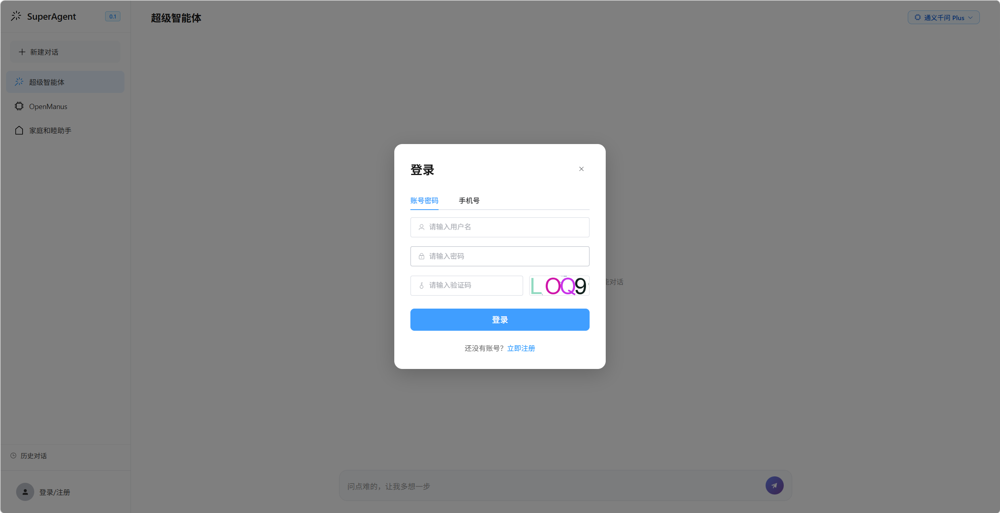
  <br>
  <em>登录页面</em>
</p>

<p align="center">
  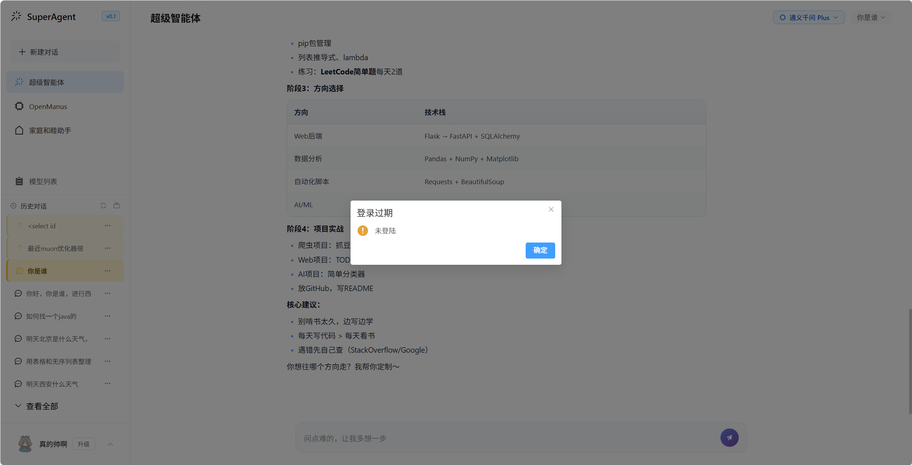
  <br>
  <em>未登录首页</em>
</p>

<p align="center">
  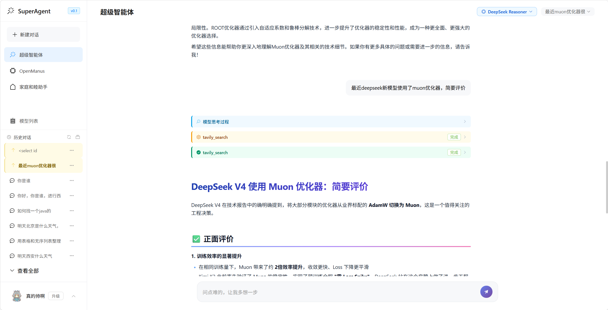
  <br>
  <em>主界面 - AI 对话</em>
</p>

<p align="center">
  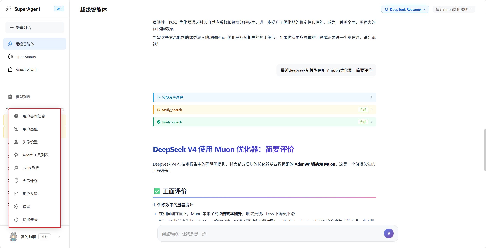
  <br>
  <em>功能菜单</em>
</p>

<p align="center">
  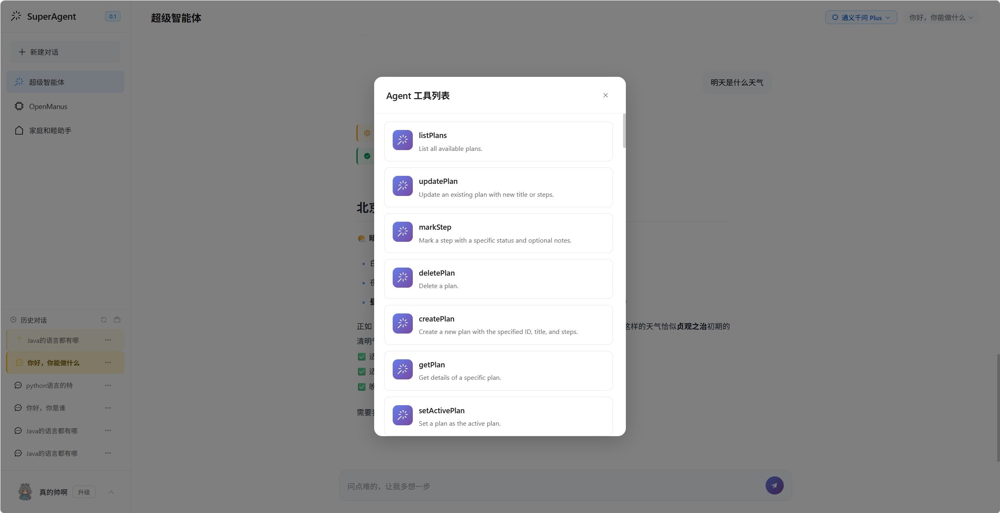
  <br>
  <em>工具调用展示</em>
</p>

<p align="center">
  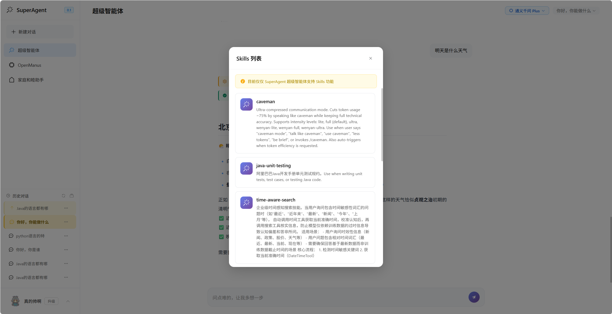
  <br>
  <em>技能系统</em>
</p>

<p align="center">
  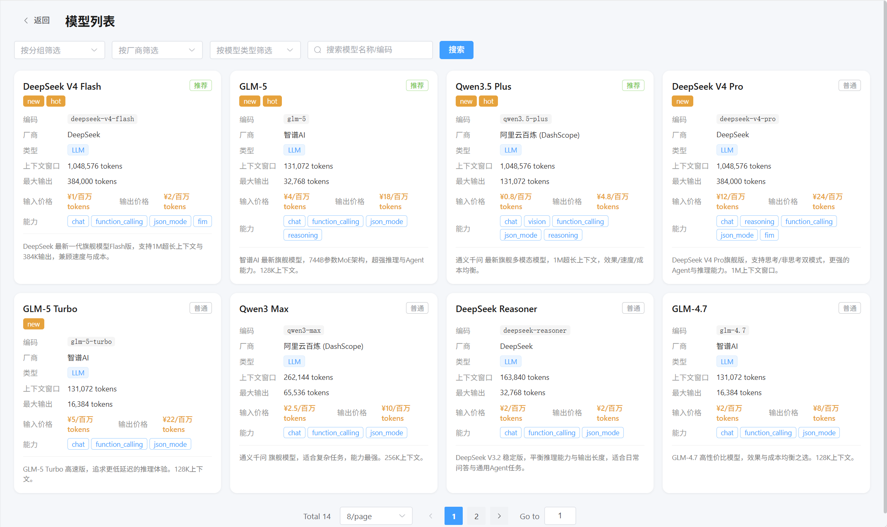
  <br>
  <em>模型列表管理</em>
</p>

<p align="center">
  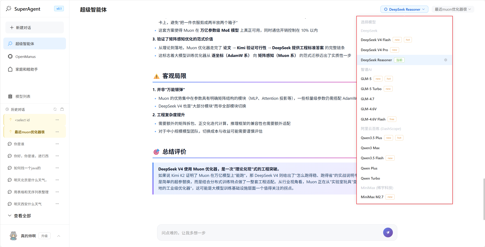
  <br>
  <em>模型选择</em>
</p>

<p align="center">
  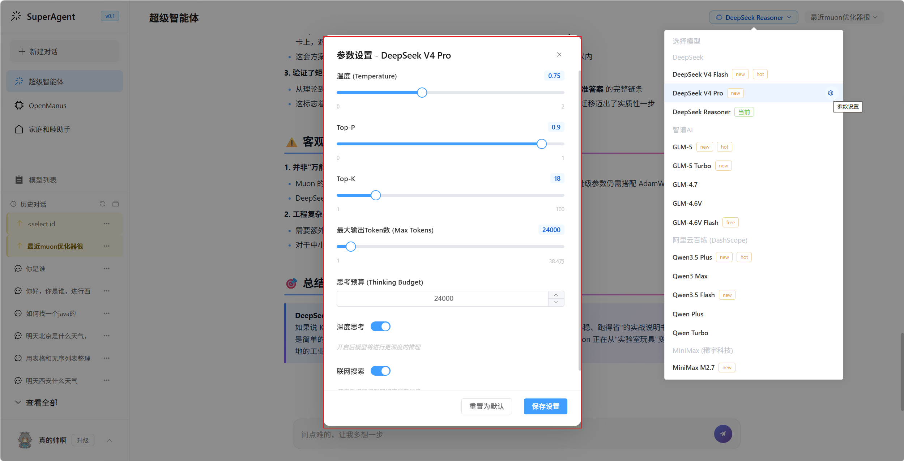
  <br>
  <em>模型参数配置</em>
</p>

<p align="center">
  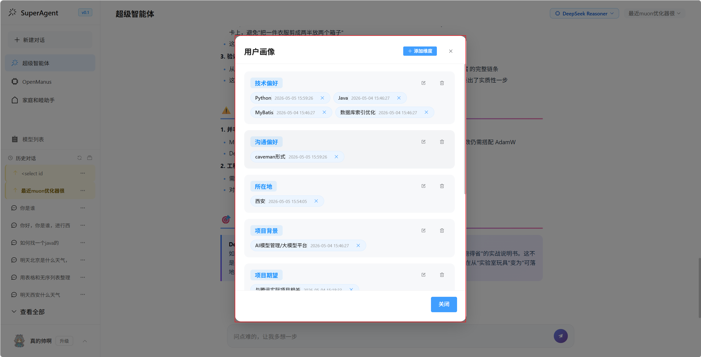
  <br>
  <em>用户画像管理</em>
</p>

<p align="center">
  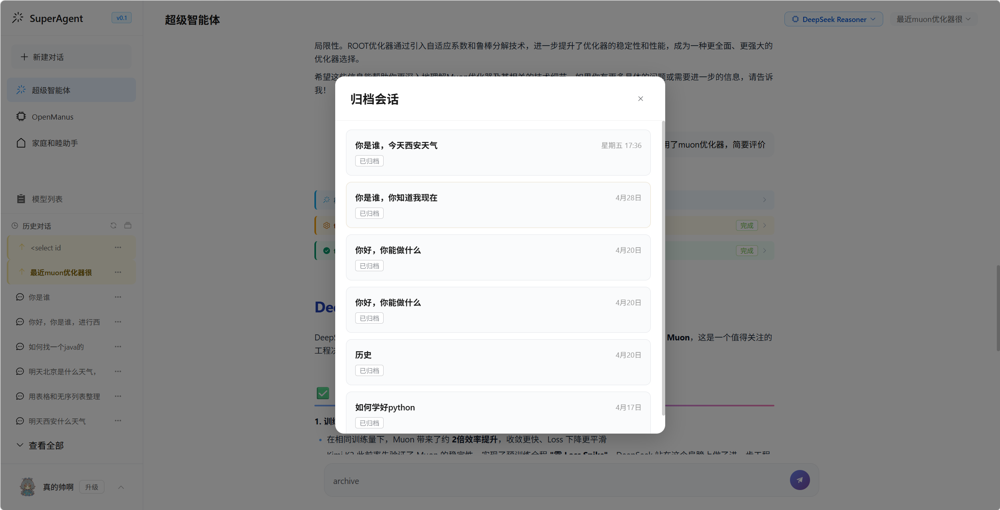
  <br>
  <em>会话归档功能</em>
</p>

---

## 项目结构

```
SuperAgent/
├── frontend/                          # 前端 (Vue 3 + Vite)
│   ├── src/api/                       # API 接口层
│   ├── src/components/                # 组件 (对话、登录、模型配置等)
│   ├── src/stores/                    # Pinia 状态管理
│   ├── src/views/                     # 页面视图 (ChatView, ModelListView)
│   └── src/utils/                     # 工具函数
│
├── src/main/java/cn/sgnxotsmicf/
│   ├── SuperAgentApplication.java     # 启动类
│   ├── app/                           # 智能体实现层
│   │   ├── manus/                     # Manus 代理 (Spring AI + Alibaba 组件)
│   │   ├── superagent/                # SuperAgent 核心 (纯 Spring AI Alibaba)
│   │   │   ├── factory/               # Agent 工厂 (抽象工厂模式)
│   │   │   ├── hook/                  # Hook 机制 (日志/消息/模型)
│   │   │   └── interceptor/           # 拦截器 (提示词/缓存/监控)
│   │   └── family/                    # 家庭和谐应用示例
│   ├── agentTool/                     # 工具生态
│   │   ├── commonTool/                # 通用工具 (规划/过滤/提问)
│   │   ├── localtool/                 # 本地工具 (Bash/浏览器/文件/PDF)
│   │   ├── onlinetool/                # 在线工具 (搜索/爬取/邮件/新闻)
│   │   └── specialTool/               # 特殊工具 (终止)
│   ├── advisor/                       # Spring AI Advisor
│   ├── chatMemory/                    # 聊天记忆 (Redis/MySQL/File)
│   ├── controller/                    # REST API 控制器
│   ├── service/                       # 业务逻辑层
│   │   ├── impl/                      # 实现类
│   │   └── strategy/                  # 策略模式 (登录/注册/会话)
│   ├── dao/                           # 数据访问层 (Mapper)
│   ├── common/                        # 公共模块
│   │   ├── po/                        # 持久化对象 (Entity)
│   │   ├── vo/                        # 视图对象 (VO)
│   │   ├── dto/                       # 数据传输对象 (DTO)
│   │   ├── auth/                      # 权限与安全上下文
│   │   ├── rabbitmq/                  # RabbitMQ 消息队列
│   │   └── version/                   # 版本信息
│   ├── config/                        # 配置类 (AI/Redis/MinIO/CORS/SaToken)
│   ├── rag/                           # RAG 检索增强生成
│   ├── exception/                     # 异常处理
│   └── job/                           # 定时任务
│
├── skills/                            # 技能定义 (SKILL.md)
├── rag/                               # RAG 知识库文档
├── sql/                               # 数据库初始化脚本
├── assests/                           # 项目截图
└── pom.xml                            # Maven 配置
```

---

## 技能系统 (Skills)

SuperAgent 支持通过 `SKILL.md` 文件定义技能，实现可插拔的 AI 能力：

```markdown
---
name: java-coding-standards
description: Java 编码规范检查与建议
---

# Java 编码规范

## 命名规范
- 类名使用大驼峰命名法
- 方法名使用小驼峰命名法
...
```

内置技能：
- `java-coding-standards` - Java 编码规范
- `java-design-standards` - Java 设计规范
- `java-security-standards` - Java 安全规范
- `time-aware-search` - 时间感知搜索
- `caveman` - 极简通信模式

---

## API 文档

启动后访问 Swagger UI：
```
http://localhost:8123/swagger-ui.html
```

主要接口：
- `POST /api/super-agent/chat` - 流式对话
- `POST /api/manus/chat` - Manus 代理对话
- `GET /api/session/list` - 获取会话列表
- `POST /api/user/login` - 用户登录
- `GET /api/model/list` - 获取模型列表
- `GET /api/model/token/usage` - Token 用量查询

---

## 配置说明

### AI 模型配置 (application-dev.yml)
```yaml
spring:
  ai:
    dashscope:
      api-key: your-dashscope-api-key
    openai:
      api-key: your-openai-api-key
    deepseek:
      api-key: your-deepseek-api-key
```

### MCP 服务器配置 (mcp-servers.json)
```json
{
  "mcpServers": {
    "filesystem": {
      "command": "npx",
      "args": ["-y", "@modelcontextprotocol/server-filesystem", "/path/to/files"]
    }
  }
}
```

---

## 版本更新

### v0.2 (当前版本)

| 属性 | 内容 |
|------|------|
| **版本号** | v0.2 |
| **作者** | sgnxotsmicf |
| **性质** | 🎓 个人学习项目 |
| **描述** | 多智能体平台服务项目 |
| **状态** | 🚧 持续学习开发中 |

#### 🆕 v0.2 新增功能

| 模块 | 更新内容 |
|------|----------|
| **模型管理系统** | 新增 Model/ModelConfig/ModelGroup/ModelProvider 实体及完整 CRUD，支持多模型分组管理与配置 |
| **Token 用量监控** | 新增 ModelAndTokenController/TokenUsageService，支持用户 Token 消耗统计与查询 |
| **模型参数自定义** | 前端新增 ModelParamDialog，支持用户自定义温度、top_p、top_k 等模型参数 |
| **模型列表页面** | 前端新增 ModelListView，可视化展示可用模型及分组 |
| **登录注册重构** | 采用策略模式重构登录/注册流程，支持密码登录、手机号登录两种策略 |
| **Agent 工厂模式** | 重构 SuperAgentFactory 为抽象工厂模式，新增 Qwen/DeepSeek/GLM/MiniMax 等具体 Creator |
| **用户画像增强** | 完善 UserProfileDialog 与 UserProfileServiceImpl，丰富用户画像管理 |
| **AOP 请求校验** | 新增 RequestValidation 注解 + AOP 切面，统一请求参数校验 |
| **安全上下文** | 新增 UserInfoContext/SecurityConstants，增强用户身份上下文传递 |
| **RabbitMQ 增强** | 新增 SessionMessage/MqFailMessage 实体，完善消息消费与失败重试机制 |

#### 🔧 v0.2 优化改进

| 模块 | 改进内容 |
|------|----------|
| **前端 Markdown 渲染** | 大幅优化 MarkdownRenderer，提升代码高亮、数学公式等渲染效果 |
| **前端主界面** | 重构 MainContent 组件，优化对话交互与布局 |
| **前端登录页** | 重构 LoginDialog，整合登录/注册流程，优化表单交互 |
| **后端流式输出** | 修复前端流式输出及工具调用的稳定性问题 |
| **后端权限安全** | 修复后端权限漏洞，优化前后端交互安全 |
| **后端推理持久化** | 修复推理内容无法持久化的问题 |
| **后端模型兼容性** | 修复多模型兼容性问题 |
| **ReAct 线程安全** | 修复手写 ReAct 的线程安全问题 |
| **Sa-Token 流式** | 解决 Sa-Token 流式输入异常问题 |
| **RabbitMQ 功能** | 完善 RabbitMQ 相关功能 |

#### 📸 v0.2 新增截图

新增未登录首页、模型列表、模型选择、模型参数配置等页面截图。

---

### v0.1 (初始版本)

| 属性 | 内容 |
|------|------|
| **版本号** | v0.1 |
| **描述** | 基础功能完善的 AI 前后端项目 |

v0.1 作为项目初始版本，实现了以下核心功能：
- 多 Agent 架构（SuperAgent、Manus、FamilyHarmony）
- ReAct / ToolCall 两种代理模式
- 20+ 内置工具生态
- SSE 流式响应
- 用户认证与会话管理
- RAG 知识库基础流程
- RabbitMQ 异步归档
- 前端 Vue3 基础交互

---

## 已知问题 ⚠️

> **说明**：当前版本处于早期开发阶段，存在以下已知问题和不足。这些问题来自代码中的 [SuperAgentDeficiency.java](./src/main/java/cn/sgnxotsmicf/common/version/SuperAgentDeficiency.java) 定义，会逐步修复完善。

### 功能与体验问题

| 问题               | 说明                                     | 优先级  |
|------------------|----------------------------------------|------|
| **前端渲染细节**       | 流式 Markdown 渲染基本成功，但仍有部分细节不足 | 🟡 中 |
| **更多细节不足**       | 包括提示词优化、Rag、异常处理等各种细节都有待提高 | 🟢 高 |
| **Rag 流程不足**     | 只是添加了一个流程，没有更深层次的架构设计 | 🟢 高 |
| **鉴权验证不足**       | 正在逐步优化中 | 🟡 中 |

> 💡更多详细缺陷定义见 [SuperAgentDeficiency.java](./src/main/java/cn/sgnxotsmicf/common/version/SuperAgentDeficiency.java)

---

## 更新计划

> 🎓 **持续学习，持续进步**：本项目作为学习项目，将跟随技术发展和个人成长不断更新完善。

计划中的学习方向和功能包括：

- [x] 修复流式输出和工具调用的稳定性问题
- [x] 完善前端 Markdown 渲染和交互体验
- [ ] 完善Spring AI Alibaba不兼容的Message级别管理
- [ ] 优化提示词及模型调用完整链路
- [x] 解决Sa-Token的流式输入异常问题
- [x] 支持用户自定义模型参数（温度、top_p、top_k 等）
- [ ] 增加更多内置工具和技能
- [ ] 优化 RAG 检索效果与完整架构链路
- [x] 支持更多 AI 模型接入
- [x] 模型管理与 Token 用量监控
- [x] 登录注册策略模式重构
- [ ] 更多更完善的工具和skills,以及其调用流程
- [ ] 完善单元测试和文档
- [ ] 提供 Docker 一键部署方案

**长期目标**: 打造一个功能完善、稳定可靠、易于扩展的开源多智能体 AI 平台。

---

## 许可证

本项目采用 [MIT](LICENSE) 许可证开源。

---

## 联系方式

如有问题或建议，欢迎通过以下方式联系：
- 提交 GitHub Issue
- 发送邮件至: lixiangzhenshuaiqi@163.com

---

<p align="center">
  <b>如果这个项目对你有帮助，请给个 Star ⭐</b>
</p>

<p align="center">
  <b>持续学习，持续更新 🚀</b>
</p>
